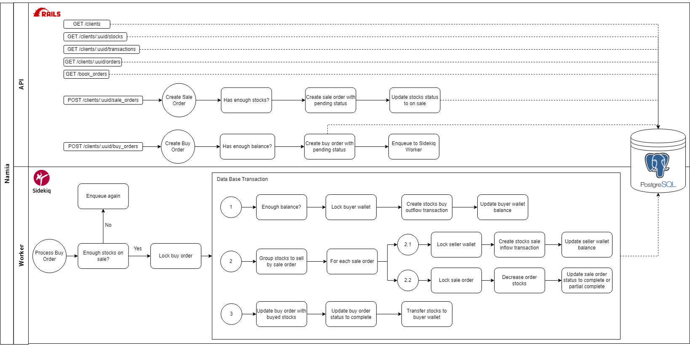

# Narnia
## _A Order Book API_


Narnia is a MVP that implements a book order API. With Narnia, it's possible to:

- Create a buy order for a specific stock;
- Create a sell order for specific stock;
- Keep track of executed orders;
- See wallet transaction for each client.

## Stack

- Ruby 2.6.3
- Rails 6.1.7
- Sidekiq
- PostgreSQL
- Redis

## Requirements

- Docker
- Docker-compose: 3.4+ 

## Installation

To deploy the project in you development enviroment execute:

```sh
docker-compose up -d
```

## Getting Started

The primary you need to check if the project is running.

- Narnia: [http://localhost:3000](http://localhost:3000).
- Sidekiq dashboard: [http://localhost:3000/sidekiq](http://localhost:3000/sidekiq).

## Architecture



## API documentation

Postman collection is [here](API.postman_collection.json).

You can also see the apis below:

**Book orders**

```sh
curl --location 'localhost:3000/order_books'
```

**List clients**

```sh
curl --location 'localhost:3000/clients'
```

**List client stocks**

```sh
curl --location 'localhost:3000/clients/:uuid/stocks'
```

**List client transactions**

```sh
curl --location 'localhost:3000/clients/:uuid/transactions'
```

**List client orders**

```sh
curl --location 'localhost:3000/clients/:uuid/orders'
```

**Create a buy order**

```sh
curl --location 'localhost:3000/clients/:uuid/buy_orders' \
--header 'Content-Type: application/json' \
--data '{
    "stock_kind": "vibranium",
    "unit_price": "17.5",
    "quantity": 15,
    "expired_at": "2023-5-18"
}'
```

**Create a sale order**

```sh
curl --location 'localhost:3000/clients/:uuid/sale_orders' \
--header 'Content-Type: application/json' \
--data '{
    "stock_kind": "vibranium",
    "unit_price": "17.5",
    "quantity": 50,
    "expired_at": "2023-5-19"
}'
```
